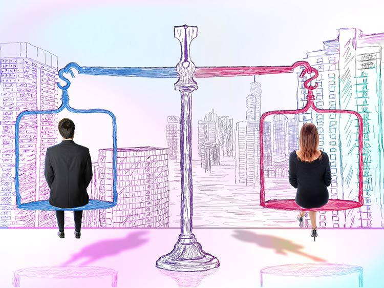

```{r setup, include=FALSE}
knitr::opts_chunk$set(echo = TRUE)
```
# {.tabset .tabset-fade .tabset-pills}

## Synopsis

<!-- Summary of the Project  -->
Women have been tested by the disparity in the workforce throughout the years. Until current occasions, lawful and social practices, joined with the latency of longstanding strict and instructive shows, limited ladies' entrance and interest in the workforce. 

**The gender pay gap** is the gap between what people are paid. Most generally, it alludes to the middle yearly pay of all ladies who work all day and all year, contrasted with the compensation of a comparable companion of men. It is significant for us to distinguish which business areas and occupations have a critical sex pay hole. It is additionally significant for us to distinguish if there has been any improvement in overcoming any issues regarding time. 

We would perform an exploratory data examination on the chronicled information about ladies' profit and business status. We will utilize summaries and diagrams, in order to find designs and to spot peculiarities. When we recognize the loopholes, we could progress in the direction of connecting the crisis in particular areas and promote fairness.


<!-- Display the Image -->
<center>

 

</center>


## Packages Required

```{r Loading the required packages, echo=TRUE, results='hide', message=FALSE}
library(tidyr)
library(DT)
library(ggplot2)
library(dplyr)
library(tidyverse)
library(kableExtra)
library(lubridate)
library(readxl)
library(highcharter)
library(lubridate)
library(scales)
library(RColorBrewer)
library(wesanderson)
library(plotly)
library(shiny)
library(readxl)
library(ggalt)

```

```{r displaying the packages table, echo=FALSE}
#Reading the variable summary excel File
package_sum <- read_excel("D:/OneDrive - University of Cincinnati/GitHub/SayakChakraborty/Women in the Workplace Analysis in R/WomenWorkplace_Analysis_R/Package Summary.xlsx")

kable(package_sum) %>%
  kable_styling(bootstrap_options = c("striped", "hover", "condensed", "responsive", "sm"), full_width = F, fixed_thead = T, )
``` 


## Data Preparation {.tabset .tabset-fade .tabset-pills}

### Data Source

There are historical data about women's earnings and employment status, as well as detailed information about specific occupation and earnings from 2013-2016 from the [Bureau of Labor Statistics](https://www.bls.gov/opub/ted/2017/percentage-of-employed-women-working-full-time-little-changed-over-past-5-decades.htm) and the [Census Bureau](https://www.bls.gov/opub/ted/2012/ted_20121123.htm) about women in the workforce.

### Explanation of Source Data
 
The data used in the analysis can be found [here](https://github.com/rfordatascience/tidytuesday/tree/master/data/2019/2019-03-05).
The data consists of three tables. 

The first one contains information about the major employment sectors, occupations, proportion of women and the percentage earnings of women in that occupation. It has *2008 observations* and *12 variables*.

<center>  **jobs_gender.csv** </center>

```{r read jobs_gender, echo=FALSE}
dt1 <- read_excel("D:/OneDrive - University of Cincinnati/GitHub/SayakChakraborty/Women in the Workplace Analysis in R/WomenWorkplace_Analysis_R/table1.xlsx",sheet = 1)

kable(dt1) %>%
  kable_styling(bootstrap_options = c("striped", "hover", "condensed", "responsive"))
```

<hr/>
<br/>

The second table describes the percent of earnings of women with respect to men , for different age groups over the span of time. It has *264 observations* and *3 variables*.

<center> **earnings_female.csv** </center>
```{r read earnings_female, echo=FALSE}
dt1 <- read_excel("D:/OneDrive - University of Cincinnati/GitHub/SayakChakraborty/Women in the Workplace Analysis in R/WomenWorkplace_Analysis_R/table1.xlsx",sheet =2)

kable(dt1) %>%
  kable_styling(bootstrap_options = c("striped", "hover", "condensed", "responsive"))
```

<hr/>
<br/>

This table contains data of proportion of women and men working part-time and full-time over the span of time. It has *49 observations* and *7 variables*.

 <center> **employed_gender.csv** </center>
```{r read employed_gender, echo=FALSE}
dt1 <- read_excel("D:/OneDrive - University of Cincinnati/GitHub/SayakChakraborty/Women in the Workplace Analysis in R/WomenWorkplace_Analysis_R/table1.xlsx",sheet =3)

kable(dt1) %>%
  kable_styling(bootstrap_options = c("striped", "hover", "condensed", "responsive"))
```

<hr/>
<br/>

### Data Cleaning


```{r Read all 3 excel files, echo=TRUE, warning=FALSE,}
jobs_gender <- read.csv("jobs_gender.csv")
earnings_female <- read.csv("earnings_female.csv")
employed_gender <- read.csv("employed_gender.csv")
```

We now take a look at the structure of the data and also their summary statistics. The summaries would help us spot any anomalities like negative or extreme values. It would also indicate the fields with missing values and their counts.

```{r Structure & Summary - Jobs_gender, echo=TRUE, warning=FALSE,}
str(jobs_gender)
summary(jobs_gender)
```

We see that there are 4 missing values under the column 'total_earnings_male', 65 missing values for 'total_earnings_female' and 846 missing values under 'wage_percent_of_male' from the first table- 'jobs_gender'.

Since 4 and 65 correspond to 0.19% and 3.11% of the dataset respectively, we could remove them from further analysis.
However, 846 is a signicant fraction we wouldn't remove those obeservation. 
The values for these observations can be computed using the formula total_earnings_female/total_earnings_male X 100.

We would rename the field 'wage_percent_of_male' to 'wage_percent_female_wrt_male' for clarity.

We also see from the summary() for job_gender table, the minimum value for both columns: workers_male and workers_female is 0. This indicates that there are certain occupations where either only male or female employees work.

```{r filtering no. of workers, echo=TRUE, warning=FALSE,}
jobs_gender%>% filter(workers_female==0)%>% count()
jobs_gender%>% filter(workers_male==0)%>% count()
```

These observations have NA values in their corresponding earnings variables hence they are automatically handled.

```{r filtering jobs_gender, echo=TRUE, results='hide', warning=FALSE}
jobs_gender <- jobs_gender %>% filter(!is.na(total_earnings_male) &  !is.na(total_earnings_female)) %>% rename(wage_percent_female_wrt_male = wage_percent_of_male) 

jobs_gender$wage_percent_female_wrt_male[is.na(jobs_gender$wage_percent_female_wrt_male)] <- jobs_gender$total_earnings_female/jobs_gender$total_earnings_male *100
```


We will now look into the table earnings_female that provides us data regarding percentage earnings of women of various age groups over the years.

```{r str summary & unique - earnings_female, warning=FALSE}
str(earnings_female)
summary(earnings_female)
unique(earnings_female$group)

```

Here we find a group named "Total, 16 years and older" in the group column . This does not giving any proper insights hence we will remove those values from the data set.

```{r filter earnings_female, echo=TRUE, warning=FALSE}
earnings_female <- earnings_female %>% 
                          filter(str_detect(group, "Total, 16 years and older") == FALSE)
```


Now taking a look at the employed_gender table**

```{r str summary employed_gender}
str(employed_gender)
summary(employed_gender)
```

We will use the **employed_gender** table as it is as there are no concerning issues.

Now the data is ready for analysis.


### Cleaned Data{.tabset .tabset-fade .tabset-pills}

The cleaned data can be found below:


#### earnings_female
```{r  datatable earnings_female, echo=TRUE}
datatable(earnings_female, filter = 'top')
```

#### employed_gender
```{r datatabale employed_gender, echo=TRUE}
datatable(employed_gender, filter = 'top')
```

#### jobs_gender
```{r datatable jobs_gender, echo=TRUE}
datatable(jobs_gender, filter = 'top')
```

## Exploratory Data Analysis{.tabset .tabset-fade .tabset-pills}

### a. Analysis by occupational category

We grouped and divided the job_gender data with respect to each major category that gave us an idea where the pay gap is maximum and minimum. Few interesting observations from the analysis are:

* Even though the women earns a maximum salary by around 22% when compared to the maximum salary earned by men in Production, Transportation and Material Moving Category, the percentage pay gap difference between men and women is maximum. This is a category with 75% men in the workforce where the minimum salary earned by women is 189% less than the minimum salary earned by men.

* In the Healthcare Practioners and Technical Category, where the women in the workplace is more than men, still they receive less earning by around 20% when compared to male.

* Further analysis indicates that the earning of women is independent on the represntation of women in the workplace for each category.

* We can also see the trend that as the age of the women increases, the pay gap also increases.


1. We summarize and visualize the mean earning of women in comparison to men by each major category of occupation.


```{r summary mean earning women vs men, echo=TRUE, warning=FALSE , fig.width=10}
summary1 <- jobs_gender %>% 
  group_by(major_category) %>%
  summarize( mean_earnings_female = sum(total_earnings_female)/n(), mean_earnings_male = sum(total_earnings_male)/n()) %>% 
  mutate(perc_difference = (mean_earnings_male - mean_earnings_female)/mean_earnings_female*100)

 mean_perc_diff <- mean(summary1$perc_difference)

ggplot(summary1, aes(x= major_category, y= perc_difference)) + geom_col(fill="lightblue") +
  geom_col(stat ="identity", color = "black", fill="#C91B1B")+
  geom_text(aes(label = round(perc_difference,0)), size = 3, hjust=1.5, color = "white") +
  ggtitle("Percentage Difference in Earnings \n by Major Occupational Category",) +
  xlab("Major Occupation Category") + 
  ylab("Percentage Difference") + 
  theme(legend.position = "right",
        plot.title = element_text(color = "black", size = 14, face = "bold", hjust = 0.5),
        plot.subtitle = element_text(color = "darkblue", hjust = 0.5),
        axis.title.y = element_text(),
        axis.title.x = element_text(),
        axis.ticks = element_blank()) + 
  coord_flip() 

```

We see that there is a significant positive difference in earnings of women in comparison to men in all major occupational categories. The percentage difference is as high as 25% in categories like **Production, Transportation, and Material Moving** and in **Management, Business and Finacial**.
The least differnce is (around 13%) in the field of **Natural Resources, Construction and Maintanence**. The overall average in pay gap is around 19% across all categories.


2. We will look at the minmum and maximum salaries in each department. We are interested in learning if these are salaries earned by a woman or a man

```{r summary 2 calculations, echo=TRUE, warning=FALSE, fig.width=10}
summary2 <- jobs_gender %>% 
                  group_by(major_category) %>%
                  summarize( max_earnings_female = max(total_earnings_female), max_earnings_male = max(total_earnings_male), min_earnings_female = min(total_earnings_female), min_earnings_male = min(total_earnings_male)) %>%
                  mutate(perc_max_difference = (max_earnings_male - max_earnings_female)/max_earnings_female*100, perc_min_difference = (min_earnings_male - min_earnings_female)/min_earnings_female*100) %>%
                  mutate(if_female_max= perc_max_difference <0, if_female_min= perc_min_difference>0) %>%
                  select(major_category,perc_max_difference,perc_min_difference,if_female_max,if_female_min)

```

```{r Percentage diff in Max Salary, echo=TRUE, warning=FALSE, fig.width=10}
  ggplot(summary2, aes(x= major_category, y= perc_max_difference, fill=if_female_max)) + 
        geom_bar(stat ="identity", color = "black") + 
        scale_fill_manual(values=c("#040059", "#37FE00"), labels = c("Male earning more", "Female earning more")) +
        geom_text(aes(label = round(perc_max_difference,0)), size = 3,hjust= 0, color = "black")+
        ggtitle("Who earns the maximum salary \n and by how much?") +
        ylab("Percentage Difference in Maximun Salary of Male and Female") +
        xlab("Major Occupational Category") +
        coord_flip() + 
        ylim(-55,55) +
        guides(fill=guide_legend(" ")) + 
        theme(legend.position = "right",
        plot.title = element_text(color = "black", size = 14, face = "bold", hjust = 0.5),
        plot.subtitle = element_text(color = "darkblue", hjust = 0.5),
        axis.title.y = element_text(),
        axis.title.x = element_text(),
        axis.ticks = element_blank())

```

```{r Percentage diff in Min Salary, echo=TRUE, warning=FALSE, fig.width=10}
 ggplot(summary2, aes(x= major_category, y= perc_min_difference,fill=if_female_min)) + 
  geom_col(stat ="identity", color = "black") + 
  scale_fill_manual(values=c("#040059", "#37FE00"), labels = c("Male earning less", "Female earning less")) +
  geom_text(aes(label = round(perc_min_difference,0)), size = 3, hjust= 0) +
  ggtitle("Who earns the minimum salary \n and by how much?") +
  ylab("Percentage Difference in Minimum Salary of Male and Female") +
  xlab("Major Occupational Category") +
  coord_flip() + 
  guides(fill=guide_legend(" ")) +
  ylim ( -50, 200) + 
  theme(legend.position = "right",
        plot.title = element_text(color = "black", size = 14, face = "bold", hjust = 0.5),
        plot.subtitle = element_text(color = "darkblue", hjust = 0.5),
        axis.title.y = element_text(),
        axis.title.x = element_text(),
        axis.ticks = element_blank())
```


Comparing maximum and minimum values of earnings in each major category, we see that women are earning the minimum salaries in most categories. They earn the maximum salaries in about three major categories.
In the category of Production, Transportation and Material Moving, we see that a woman earns the maximun as well as the minimum salary. This is the department with the highest difference in the mean salary too.


3. We now take a look at the proportion of women in each of the major categories.

```{r proportion of women of the major categories, echo=TRUE, warning = FALSE , fig.width=10}
summary3 <- jobs_gender %>%
  group_by(major_category) %>%
  summarise(total_female_percent = sum(workers_female)/sum(total_workers)*100,
            total_male_percent = sum(workers_male)/sum(total_workers)*100)  %>% 
  gather(key=gender, value = proportion, total_female_percent:total_male_percent)

ggplot(summary3, aes(x=major_category, y= proportion, fill= gender)) + 
  geom_col(color = "black") + 
  scale_fill_manual(values=c("#37FE00", "#040059"), labels = c("Percentage of Women", "Percentage of Men")) +
  ggtitle("Representation of Women in Each \n Occupational Category") +
  ylab("Propotion Value") +
  xlab("Major Category")+ 
  coord_flip() +
  guides(fill=guide_legend(" ")) + 
  theme(legend.position = "right",
        plot.title = element_text(color = "black", size = 14, face = "bold", hjust = 0.5),
        plot.subtitle = element_text(color = "darkblue", hjust = 0.5),
        axis.title.y = element_text(),
        axis.title.x = element_text(),
        axis.ticks = element_blank())
```

We see that the category of Natural Resources,Construction and Maintenance is highly male dominated. The healthcare Practitioners and Technical department have largest proportion of women but still have a pay gap of 20%. Service Sales and Office , Management Business have about 50% of women representation.


4. To study the correlation between the earnings of women and their representation in each category, we look at the correlation values.

```{r echo = TRUE, warning = FALSE}

correlation <- jobs_gender %>% group_by(major_category) %>% 
  summarize(cor =cor(percent_female,wage_percent_female_wrt_male))

kable(correlation) %>%
  kable_styling(bootstrap_options = c("striped", "hover", "condensed", "responsive", "sm"), full_width = F, fixed_thead = T, )
```

From the above results we can confirm that the represantation of women in an occupational category does not influence their earnings.

5.Now we use the earning females table to visualize the aggregate percentage earnings of female with respect to male for various age categories of women over the years.

```{r aggregate percentage earnings, echo=TRUE, warning=FALSE, fig.width=10}
data2 <- earnings_female %>%
  group_by(group) %>%
  summarise(average_percent_female = sum(percent)/n()) 


data2 %>% ggplot(aes(x=group, y=average_percent_female)) + 
  geom_col(fill= "#1FCA19" , color = "black") + 
  coord_flip() +
  geom_text(aes(label = round(average_percent_female,0)), size = 3, hjust=2)+
  ggtitle("Percentage Earnings of Women of Various Age Groups") +
  xlab("Age Group of Women") +
  ylab("Percentage Earning of Women with Respect to Men") + 
  theme(legend.position = "right",
        plot.title = element_text(color = "black", size = 14, face = "bold", hjust = 0.5),
        plot.subtitle = element_text(color = "darkblue", hjust = 0.5),
        axis.title.y = element_text(),
        axis.title.x = element_text(),
        axis.ticks = element_blank())

```


Women belonging to the age-group of 16-19 years and 20-24 years face lesser pay gap in comparison to the remaining. The pay gap among age groups tend to increase with respect to age of women. However the pay gap reduces again for women of age 65 years and older.


### b. Analysis with respect to Time

We grouped and divided the data with respect to time frame which gave us an idea where the pay gap is maximum and minimum. Few interesting observations from the analysis are:

* Salary earned by women in 2016 in all major category is less than the salary earned by men in 2013.

* Even though the proportion of women in each major category is more or less the same from 2013 to 2016, there are some category where mean salary obtained by women fluctuates from 2013 to 2016

* We also see that the part time female workers are around 3 times compared to part time male workers but their proportion  decreases with the increase in year.

* Younger women face less gender pay gap compared to elder women.


1.We check how the salary has changed for each major occupational category over the time period for both men and women.

```{r salary change female, echo= TRUE, warning=FALSE}
#Jobs Gender Table:  Increment in each year
data_year_female <- jobs_gender %>%
  select(year, major_category, total_earnings_female) %>%
  group_by(year,major_category) %>%
  summarise(average_earning_female= mean(total_earnings_female)) %>%
  spread(key=year, value = average_earning_female) %>% 
  mutate(Increment= round(((`2016`-`2013`)/`2013`)*100,digit = 2))

kable(data_year_female) %>%
  kable_styling(bootstrap_options = c("striped", "hover", "condensed", "responsive", "sm"), full_width = F, fixed_thead = T, )

```

```{r salary change female graph, echo = TRUE, warning = FALSE, fig.width=10}
ggplot(data_year_female, aes(x=`2013`, xend=`2016`, y=major_category )) + 
geom_dumbbell()+
   geom_segment(aes(x=`2013`, 
                         xend=`2016`, 
                         y=major_category,
                         yend=major_category), 
                     color="#b2b2b2", size=1.5) +
        geom_dumbbell(color="black", 
                      size_x=5.5, 
                      size_xend = 5.5,
                      colour_x="#FFEF00", 
                      colour_xend = "#37FE00") +
       geom_text(aes(label = round(Increment,0)), size = 5, hjust = 1) +
 ggtitle ("Salary Change of Women From 2013 to 2016",) +
  ylab("Major Occupation Category") + xlab("Average Salary of Women") + 
  theme(legend.position = "right",
        plot.title = element_text(color = "black", size = 14, face = "bold", hjust = 0.5),
        plot.subtitle = element_text(color = "darkblue", hjust = 0.5),
        axis.title.y = element_text(),
        axis.title.x = element_text(),
        axis.ticks = element_blank())
```


```{r salary change male, echo = TRUE, warning = FALSE }
data_year_male<- jobs_gender %>%
  select(year, major_category, total_earnings_male) %>%
  group_by(year,major_category) %>%
  summarise(average_earning_male= mean(total_earnings_male)) %>%
  spread(key=year, value = average_earning_male) %>% 
  mutate(Increment= round(((`2016`-`2013`)/`2013`)*100, digit = 2))

kable(data_year_male) %>%
  kable_styling(bootstrap_options = c("striped", "hover", "condensed", "responsive", "sm"), full_width = F, fixed_thead = T, )
```


```{r salary change male graph, echo = TRUE, warning = FALSE , fig.width=10}
ggplot(data_year_male, aes(x=`2013`, xend=`2016`, y=major_category  )) + 
geom_dumbbell() +
   geom_segment(aes(x=`2013`, 
                         xend=`2016`, 
                         y=major_category,
                         yend=major_category), 
                     color="#b2b2b2", size=1.5) +
        geom_dumbbell(color="black", 
                      size_x=5.5, 
                      size_xend = 5.5,
                      colour_x="#FFEF00", 
                      colour_xend = "#040059") +
       geom_text(aes(label = round(Increment,0)), size = 5, hjust= 1) +
 ggtitle("Salary Change of Men From 2013 to 2016",) +
  ylab("Major Occupation Category") + xlab("Average Salary of Men") + 
  theme(legend.position = "right",
        plot.title = element_text(color = "black", size = 14, face = "bold", hjust = 0.5),
        plot.subtitle = element_text(color = "darkblue", hjust = 0.5),
        axis.title.y = element_text(),
        axis.title.x = element_text(),
        axis.ticks = element_blank())
```

We see that even though there are certain category where the increment percentage(indicated by number on the dumbbell plot) in salary from 2013 to 2016 is more for women, the actual picture is very different.There is a huge pay gap per year in each major occupational categories which is evident from the fact there in all the categories the salary what a women is making in 2016 is way less than the salary what men used to make 4 years ago i.e. 2013.


2.Also, we look at the proportion of women in each occupational category over the period from 2013 to 2016

```{r Visualizing proportion by year, echo = TRUE, warning=FALSE, fig.width=10}
#Visualizing proportion by year
summary5 <- jobs_gender %>%
  select(year, major_category, total_workers, workers_male, workers_female) %>%
  group_by(year,major_category) %>%
  summarise(total_female_percent = sum(workers_female)/sum(total_workers),
            total_male_percent = sum(workers_male)/sum(total_workers)) %>%
  gather(key=gender, value = proportion, "total_female_percent":"total_male_percent")

summary5 %>% ggplot(aes(x=major_category, y= proportion, fill = gender)) + 
  geom_col() +
  scale_fill_manual(values=c("#37FE00", "#040059"), labels= c("Percentage of Women", "Percentage of Men")) +
  facet_wrap(~year) + 
  coord_flip() + 
  ggtitle("Representation of Women Over the Years") + 
  xlab("Propotion Value") +
  ylab("Major Category") +
  guides(fill=guide_legend(" ")) + 
  theme(legend.position = "right",
        plot.title = element_text(color = "black", size = 14, face = "bold", hjust = 0.5),
        plot.subtitle = element_text(color = "darkblue", hjust = 0.5),
        axis.title.y = element_text(),
        axis.title.x = element_text(),
        axis.ticks = element_blank())
 
```


We see that the representation of women in each of the categories has remained almost constant over the four years. As seen earlier, Natual Resources is one the major occupational sector which is heavily male dominated over the four years
 

```{r Visualizing salary by year, echo=FALSE, warning=FALSE, fig.width=10}
#Visualizing salary by year
summary6 <- jobs_gender %>%
  select(year, major_category, wage_percent_female_wrt_male) %>%
  group_by(year,major_category) %>%
  summarise(Average_wage_percent_female_wrt_male = mean(wage_percent_female_wrt_male))


summary6 %>%  ggplot( aes(x=year, y=Average_wage_percent_female_wrt_male )) + 
  geom_line(color = "darkblue", size = 1.5) + 
  facet_wrap(~major_category,ncol = 2) + 
  ggtitle("Salary Percentage of Women Over the Years") + 
  xlab("Year") + 
  ylab("Percentage") +
    theme(legend.position = "right",
        plot.title = element_text(color = "black", size = 14, face = "bold", hjust = 0.5),
        plot.subtitle = element_text(color = "darkblue", hjust = 0.5),
        axis.title.y = element_text(),
        axis.title.x = element_text(),
        axis.ticks = element_blank()) 

```


We see that the most drastic drop in earnings of women happens in Natural Resources in 2015. The most drastic rise happens in Service in 2014. In the categories of Computer, Healthcare , Education the salary percentages fluctute while it has remained fairly constant in Management, Production and Sales.

3. Now we use the employee gender table to derive insights for our analysis.

```{r employed_gender : part time women VS men, warning=FALSE, fig.width=10}
#employed_gender : part time women VS men

summary7 <- employed_gender %>% 
  group_by(year)  %>%  
  mutate(Ratio = sum(part_time_female)/sum(part_time_male))


ggplot(data= summary7, aes(x=year, y=Ratio, fill=year)) +
  geom_line(size=1.5, color = "#0016FF") +  
  ggtitle("Representation of Women in Part Time Jobs") + 
  xlab("Year") +
  ylab("Ratio of part time female by part time male ") +
  theme(legend.position = "right",
        plot.title = element_text(color = "black", size = 14, face = "bold", hjust = 0.5),
        plot.subtitle = element_text(color = "darkblue", hjust = 0.5),
        axis.title.y = element_text(),
        axis.title.x = element_text(),
        axis.ticks = element_blank())
  
```


The ratio of part time women keeps decreasing as the year increases which indicates that more women are taking full time jobs. In the 70's it was 3 women corresponding to one man and has now reduced to 2.

```{r employed_gender : full time women VS men, echo=TRUE, warning=FALSE, fig.width=10}

#employed_gender : full time women VS men
summary8 <-employed_gender %>% 
  group_by(year)  %>%  
  mutate ( Ratio= sum(full_time_female)/sum(full_time_male))

#Plot
ggplot (data= summary8, aes(x=year, y=Ratio, fill=year)) +
  geom_line(size=1.5, color = "#0016FF") + 
  ggtitle("Representation of Women in Time Jobs") + 
  xlab("Year") +
  ylab("Ratio of full time female by full time male ") +
  theme(legend.position = "right",
        plot.title = element_text(color = "black", size = 14, face = "bold", hjust = 0.5),
        plot.subtitle = element_text(color = "darkblue", hjust = 0.5),
        axis.title.y = element_text(),
        axis.title.x = element_text(),
        axis.ticks = element_blank())
```


From the above output we see that the number of full time women in all the year is less than the men. The ratio of full time women is more or less the same with some postive increment in the last few years. In the 70's the ratio was 100 women for about 123 men and improves to a ratio 100 women for 117 men in 2010.

```{r employed_gender : part time women VS full time women,  echo=TRUE, warning=FALSE, fig.width=10}

#employed_gender : part time women VS full time women

summary9 <- employed_gender %>%
  gather(key= time, value= proportion,part_time_female,full_time_female) %>%
  select(year, time, proportion)

#plot
ggplot(data = summary9 , aes(x= year, y=proportion, fill=(time))) +
  geom_bar(stat= 'identity', position='dodge' , color = "Black") + 
  scale_fill_manual(values=c("#0021FF" , "#FF0000"), labels = c("Full Time", "Part Time")) +
  ggtitle("Women Employees Over Various Years") + 
  xlab("Year") +ylab("Percent of Women Employees") + 
  guides(fill=guide_legend(" ")) +
  theme(legend.position = "right",
        plot.title = element_text(color = "black", size = 14, face = "bold", hjust = 0.5),
        plot.subtitle = element_text(color = "darkblue", hjust = 0.5),
        axis.title.y = element_text(),
        axis.title.x = element_text(),
        axis.ticks = element_blank())

```

```{r employed_gender : part time men VS full time men, echo=FALSE, warning=FALSE , fig.width=10}
#employed_gender : part time men VS full time men

summary10 <- employed_gender %>%gather(key= time, value= proportion,part_time_male,full_time_male) %>%
  select(year, time, proportion)


#plot

ggplot(data = summary10 , aes(x= year, y=proportion, fill=(time))) +
  geom_bar(stat= 'identity',position='dodge') +
  scale_fill_manual(values=c("#0021FF" , "#FF0000"), labels = c("Full Time", "Part Time")) +
  ggtitle("Male Employees Over Various Years") + 
  xlab("Year") +
  ylab("Percent of Male Employees") + 
  guides(fill=guide_legend(" ")) +
  theme(legend.position = "right",
        plot.title = element_text(color = "black", size = 14, face = "bold", hjust = 0.5),
        plot.subtitle = element_text(color = "darkblue", hjust = 0.5),
        axis.title.y = element_text(),
        axis.title.x = element_text(),
        axis.ticks = element_blank())

```


From the above two graphs we see that the the variation in full time and part time jobs is huge for the genders. 30% of women work in part time jobs while only about 10% of men work in part time.

4. Now we look into the earning female table to derive insights for our analysis.

```{r Year wise difference, echo=FALSE, warning=FALSE, fig.width=10}

#Year wise difference

earnings_female <- earnings_female %>% 
  filter(str_detect(group, "Total, 16 years and older") == FALSE)

#plot
ggplot(data= earnings_female, aes(x=Year, y=percent, color=group)) + 
  geom_line(size=1.2) + 
  theme(legend.key.size = unit(3,"line")) + 
  ggtitle("Percentage Earnings of Women Over the Years") + 
  xlab("Year") +
  ylab("Percent of Earnings of women with respect to men") + 
  labs(color= "Age Group") +
  theme(legend.position = "right",
        plot.title = element_text(color = "black", size = 14, face = "bold", hjust = 0.5),
        plot.subtitle = element_text(color = "darkblue", hjust = 0.5),
        axis.title.y = element_text(),
        axis.title.x = element_text(),
        axis.ticks = element_blank())

```


We see that the change in percentage of earnings for women with respect to men is increasing for the women between age group 25 to 64. The variation is random for women of age group 16 to 19 years , 20-24 years and for 65 years and older.


## Summary 

In light of the current information, we have attempted to examine the patterns and examples in the profit of women in contrast with men as for different variables. This brought about a couple of insights about the same. 

**Factor 1: Major Occupational Categories:**

We have assembled and separated the entire information concerning each significant class which gave us a thought where the compensation hole is most extreme and least. We see that there is a huge positive distinction in the income of ladies in contrast with men in all major word related classifications. 

It is likewise observed that six out of eight word related classes have the least middle pay rates earned by a lady. Though five out of these eight word related classifications have the most extreme compensation earned by a man. This shows towards the plausibility of men holding a bigger extent of generously compensated occupations in every one of these parts. 

**Factor 2: Representation of Women in the Workforce** 

We see that the extent of ladies in the workforce for every one of the divisions hasn't changed essentially throughout the years. There is no kind impact on their portrayal of their pay. It is likewise seen that they endure a compensation hole of around 10 to 20% in specific occupations like Nursing where their portrayal is above 80%. Ladies are practically 50% of the workforce. However, all things considered, ladies keep on procuring significantly not as much as men. 

**Factor 3: Full-Time and Part-Time** 

Taking proportions of the number of ladies to men in low maintenance to all day employments, we see that Women dwarf men in low maintenance occupations. All-day occupations have more men portrayal. This proposes the plausibility of the presence of a predisposition. Ladies will, in general, occupy low maintenance occupations to meet other family desires. 

**Factor 4: Time** 

We assembled and partitioned the information as for year giving us the sign whether the compensation hole increments or diminishes concerning time. The pattern recommends that however there has been a salary raise of ladies as for men throughout the years, the change isn't noteworthy for some age gatherings. It is nearly continued as before for the most seasoned and most youthful age gatherings.
